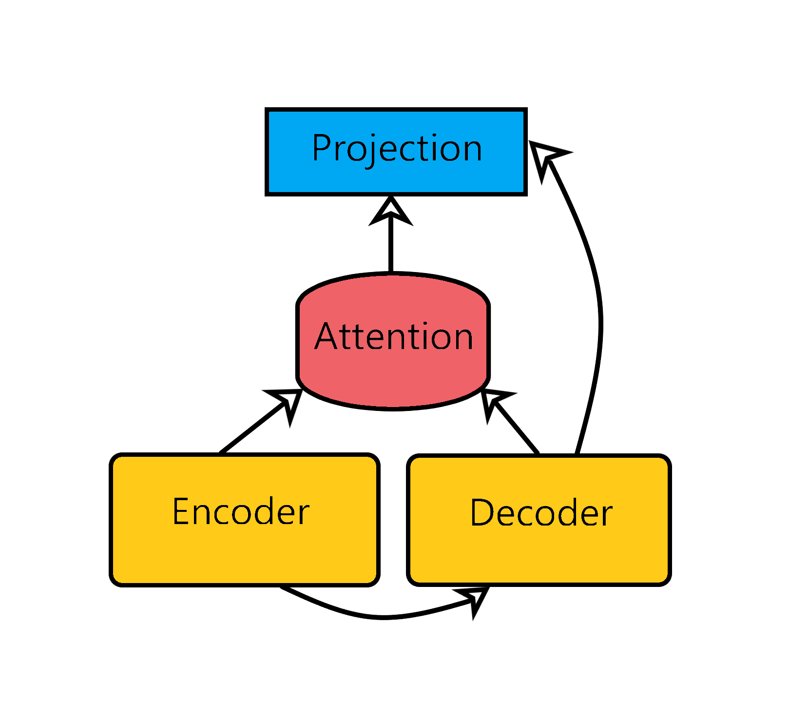
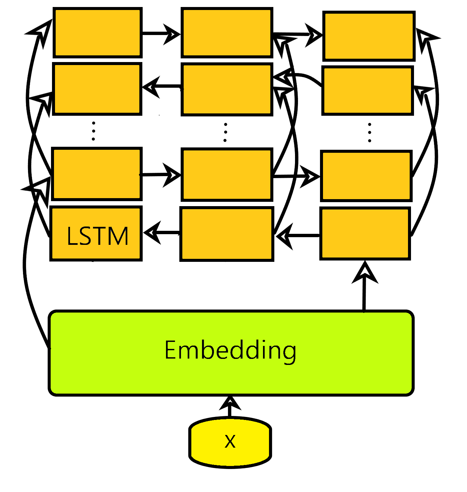

# neural-machine-translation
A Python (PyTorch) implementation of a (deep) neural network model for natural language translation.

## Table of contents

 * [Description](#description)
 * [Architecture](#architecture)
 * [Preprocessing and training](#preprocessing-and-training)
 * [Configuration and training](#configuration-and-training)
 * [References](#references)

## Description

An implementation of neural machine translation with a sequence-to-sequence architecture which includes an attention module.  

The project consists of two main parts:  

* **nmt**: a simple library built on top of PyTorch which provides (sub)modules of a neural network such as encoder and attention modules which can be used to configure the NMT model. This library also contains modules for data preprocessing and training a model

 * **run**: a Python command line tool which automates a model's configuration and training  

## Architecture

From a very abstract point of view, the architecture of a model that can be built with **nmt** looks like this:  
  

### Encoder and decoder  

The encoder and decoder modules consist of an embedding which is followed by an RNN (LSTM) layer:  

Both modules can have multiple RNN layers, but only those of the encoder can be bidirectional. Currently, the only type of embedding is a plain one, but the encoder can be generalised so that it could use a character-level CNN embedding.  

The decoder module is not what you'd typically call a decoder. The reason why it consists of only and embedding and RNN layers is that this makes it possible to implement both the encoder and decoder modules with the same more generic module (*nmt.models.seqencoder*).  

### Attention

The attention module (*nmt.models.attention*) receives a hidden vector from the decoder and all hidden vectors (*context vectors*) from the encoder and:

  1. Computes attention scores for the context vectors
  2. Transforms the scores into weights using softmax
  3. Obtains attention vectors by computing the linear combination of the context vectors, using the weights from 2.  

Of course, the module works with batches and not single samples.  

Two types of attention score are supported:  

 - multiplicative: <W_1.h_e, W_2.h_d>
 - additive: <v, tanh(W_1.h_e + W_2.h_d)>  

where W_1, W_2 and v are parameters, h_e and h_d are hidden vectors from the encoder and decoder, respectively, and <> denotes the dot product of two vectors.  

### Model

The entire model (*nmt.models.nmt*) consists of encoder, decoder and attention modules as well as projection over the words/terms in the target language.  

Some of its more detailed characteristics are:

* the input sentences are passed to the encoder which computes the context vectors (hidden vectors, concatenated in the bidirectional encoder case) for each sentence

 * the target sentences (and optionally the final encoder state, after a linear transformation) are passed to the decoder which finds the hidden vectors for each sentence
 * the input and target context vectors are passed to the attention module which computes the attention vector for each target context vector
 * the target context vectors and their corresponding attention vectors are concatenated, thus forming the final context vectors
 * the final context vectors optionally go through a linear transformation layer which is followed by a nonlinearity, and then are being projected over the target words/terms
 * the projections (scores) are then used to compute the cross-entropy loss during training and for computing a distribution (with softmax) during evaluation (translation)
 * currently the translation is done via greedy search

## Preprocessing and training

### Data preprocessing

This functionality is available in the *nmt.datapreparation* module.  

The *MetaTokens* class groups the selected meta tokens into a single object and the *Samples* class groups the input and target sentences, as well as the dictionaries extracted from them.  The sentences pairs are split into two lists with corresponding elements. Each sentence is represented with a list of tokens; the target sentences start and end with the start and end meta tokens, respectively.  

The *read_corpus* function reads a corpus of sentences, each on a separate line in a text file and creates a list of sentences - lists of tokens.  

The *extract_dictionary_from* function extracts a dictionary from a list (iterable) of sentences, extracting only those words (tokens) which have at least a certain number of occurrences in the corpus.  It also makes sure that the meta tokens are not part of the corpus and includes them into the dictionary.  

The *prepare* function prepares (preprocesses) a corpus of sentences for a model's training. It receives the paths of the two files containing the input and target sentences and creates a *Samples* object which contains the sentences as well as the two dictionaries extracted from them. That's why it also needs the meta tokens and the token occurrences threshold. Since only the training corpus needs dictionaries, the function could be called in such a way that it does not extract them.  

### Model training

This functionality is implemented in the *nmt.training* module.  

The training is done via a *ModelTrainer* object which receives the paths of the files where to store the model (and its optimizer's) checkpoints. It is also given values which determine how often it should log updates for the training state and how 'patient' it should be when the loss stops decreasing.  

The parameters that configure the training process (such as learning rate and max epochs) are grouped into an object - *TrainingParameters*, which is passed to the *ModelTrainer* object when training is started. The trainer is also provided with the model itself, its optimizer, the training and validation samples, as well as the best perplexity achieved so far (if any).  

This module also provides a top-level function that computes the perplexity of a model on a given set of samples.  

## Configuration and training

The following files are used for the configuration and training of a model:  

 * *run.py* is a command line tool for data preprocessing, model training, computing the perplexity and BLEU score of a model, and for translation
* *parameters.ini* is a configuration file used to describe/configure the model and set various parameters like the paths of the model checkpoints

### parameters.ini

This configuration file's format is the one supported by a standard [Python parser](https://docs.python.org/3.6/library/configparser.html).  

The *META TOKENS* section is where the meta tokens are set.  

The *SAMPLES* section consists of the paths of the files with input and target sentences of the test, validation and training corpuses, as well as the threshold for including a token into a dictionary.  

The *SERIALISATION* section consists of the paths of the files where the preprocessed training, validation and test data is stored, including the dictionaries. There are also two parameters for the model and its optimizer's checkpoints.  

The *ENCODER* section configures the encoder. This involves setting the embedding and hidden sizes, the number of RNN layers, the dropout rate at the RNN layers' input, and whether the encoder is bidirectional. The decoder is configured in a similar manner but it can't be bidirectional.  

In the *ATTENTION* section we need to set the common size to which the hidden encoder and decoder vectors are transformed when the attention scores are computed, as well as the type of attention score - whether it is multiplicative or additive.  

The *MODEL* section contains higher level model parameters: whether to use initial binding and whether the concatenated attention and hidden vectors should be (linearly) transformed prior to being projected on the target words. If *preprojection_nonlinearity* is set to `None`, then there is no such transformation. In order to include a linear transformation, we need to pick a nonlinearity to follow it. All the scalar/universal functions in PyTorch are supported. For example, if we pick `tanh`, *torch.tanh* would be used.  

The *TRAIN PARAMS* section consists of various parameters needed during a model's training, such as learning rate and max epochs.  

The default file can serve as example.  

### run.py

This command line tool is configured via *parameters.ini*, as described above. The configuration file must be placed in the working directory as it is looked up by relative name.  

The tool is used in the following way:  
`python run.py <command> <arguments ...>`  

What follows is a list of the supported commands:  

 * *prepare*: loads the training, validation and test data (as set in the configuration file), preprocesses it and builds Python objects that can be reused when training a model; these objects are stored on disk  
 * *train*: starts a new training process for a model. During training, the perplexity of the model is computed on the verification data at each *test_interval* (set in parameters.ini) iterations. If it is lower than the best one so far, then the current state of the model is stored on disk. If the perplexity does not improve *max_patience* times in a row, then the *learning_rate* is changed by multiplying it with *learning_rate_decay*. After *max_trials* changes of the *learning_rate*, the training is suspended  
 * *extratrain*: continues the training process of the model whose checkpoint is chosen in the configuration file  
 * *perplexity \<corpus>*: computes the perplexity of the model chosen in the configuration file on the chosen corpus. The possible values for *\<corpus>* are *test* (the default), *train* and *validation*  
 * *translate \<source> \<translation>*: translates the input sentences in the file *\<source>* and stores the translated sentences in the file *\<translation>*  
 * *bleu \<reference> \<translation>*: computes the BLEU score between a corpus of target sentences in the file *\<reference>* and the corpus of machine-translated sentences in the file *\<translation>*  

Note that this tool uses the best available device. That is, if a GPU is available, it is used. Only if no GPU is available does the tool use a CPU.  

## References

Take a look at [Britz et al.(2017) Britz, Goldie, Luong, and Le](https://www.aclweb.org/anthology/D17-1151.pdf) for great guidelines when configuring your model.  
